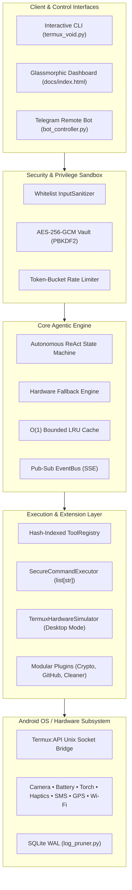

# ⚡ Void: Enterprise Edge Agentic Platform (Android / Termux)

<div align="center">

[](LICENSE)
[](https://www.python.org/)
[](https://termux.dev)
[-emerald.svg)](#-memory-benchmarks--dsa-optimizations)
[-green.svg)](#-automated-testing--verification)
[](https://ashishsinghbora.github.io/void/)

**Void** is an enterprise-grade, high-performance, ultra-low-memory local agentic platform engineered specifically for Android/Termux and mobile edge hardware. It bridges autonomous ReAct reasoning loops directly with low-level Android operating system capabilities, hardware sensors, proactive automation daemons, and a glassmorphic cyber-styled dashboard.

[One-Line Install](#-one-line-zero-friction-installer) • [Quick Start](#-quick-start--cli-launcher) • [Architecture](#-system-architecture) • [Plugins](#-modular-extension-architecture-plugin-system) • [Web Dashboard](#-glassmorphic-web-dashboard--github-pages) • [Android Hardening](#-android--termux-troubleshooting--permissions)

</div>

---

## 🚀 One-Line Zero-Friction Installer

Get Void running on a fresh Android/Termux environment or desktop development workstation with a single command:

```bash
curl -sSL https://raw.githubusercontent.com/ashishsinghbora/void/main/install.sh | bash
```

### What the installer automates:
1. **Host Detection:** Automatically identifies whether you are in native Android Termux or desktop development mode (Linux/macOS).
2. **Package Resolution:** Runs `pkg update` and provisions `termux-api`, `python`, `git`, `clang`, `libffi`, `openssl`, `jq`, and `curl`.
3. **Android Storage & Wake-Lock:** Triggers `termux-setup-storage` for `~/storage` file links and acquires a CPU wake-lock (`termux-wake-lock`) to maintain 24/7 background execution.
4. **Environment Isolation:** Provisions a dedicated virtual environment with all pinned dependencies.
5. **Global CLI Launcher:** Links the unified `void` command to `$PREFIX/bin/void` (or `~/.local/bin/void`).
6. **API Diagnostic Check:** Probes hardware endpoints to verify companion Termux:API permissions.

---

## ⚡ Quick Start & CLI Launcher

Once installed, the global `void` command gives you instant control:

```bash
# 1. Interactive ReAct Terminal Assistant (default)
void

# 2. Start Full Production Stack (Waitress WSGI + Daemons + Web UI)
void start

# 3. Start Void as a 24/7 Background Service
void start-bg

# 4. View Active Service Status, Memory RSS & Battery Telemetry
void status

# 5. Stop Running Background Service Cleanly
void stop

# 6. Reclaim Storage via System Cleaner Plugin
void clean

# 7. Run Full Automated Test Suite (34 Tests)
void test

# 8. Pull Updates from GitHub and Sync Dependencies
void update
```

---

## 🧠 System Architecture



---

## 🌟 Key Features & Enterprise Engineering

### 1. Ultra-Low Memory Footprint (< 12MB RAM Peak)
- **Zero-Allocation Class Slots:** Explicit `__slots__` declared across all high-frequency data structures, events, and response models.
- **Low-Overhead JSON Streaming:** Slices large JSON arrays (SMS conversations, contacts, Wi-Fi scans) via generator iterators, completely avoiding monolithic heap allocations.
- **LRU Memory Protection:** Bounded $O(1)$ LRU cache (doubly-linked list + hash map) with fixed capacity to ensure memory consumption never grows unbounded.

### 2. Autonomous ReAct State Machine & Hardware Fallbacks
- **Reason $\to$ Act $\to$ Observe Loop:** Step-bounded deterministic deliberation with configurable step limits.
- **Autonomous Error Recovery:** Automatically detects hardware denial or missing permissions:
  - Rear camera failure $\to$ automatically retries front selfie camera (`camera_id=1`).
  - SMS permission rejection $\to$ falls back seamlessly to Android system share sheet (`termux-share`).
  - Missing Android permissions $\to$ returns actionable step-by-step user remediation advice.

### 3. Cyber Hardened Privilege Sandboxing
- **Zero-Trust Whitelist Sanitizers:** Strict regex validation on phone numbers (E.164), paths (jail enforcement within `/sdcard` and `~`), URLs, and strings. Terminal ANSI escape sequences and null-byte injection attacks are stripped automatically.
- **Vector-Only Subprocess Execution:** Subprocesses are strictly invoked using array argument vectors (`list[str]`), completely banning `shell=True` to render shell metacharacter and command injection attacks impossible.
- **Authenticated AES-256-GCM Vault:** Stores Telegram tokens and API keys using PBKDF2-HMAC-SHA256 key derivation with 100,000 iterations, random salt, and nonces.

### 4. Zero-Bloat Persistence Layer
- **SQLite Write-Ahead Logging (WAL):** High-concurrency database engine with `PRAGMA synchronous = NORMAL` and thread-local connections.
- **Sliding-Window Log Pruner:** Enforces hard retention windows on execution logs, conversation histories, and clipboard entries using index-assisted subqueries.

---

## 🧩 Modular Extension Architecture (Plugin System)

Void features a plugin architecture located in the `extensions/` directory. Developers can build custom Python extensions that plug into Void dynamically with zero changes to core code.

### Pre-Built Default Extensions:
| Extension | Tool Name | Description | Example Query |
| :--- | :--- | :--- | :--- |
| **CryptoTracker** | `track_crypto` | Fetches live coin prices (CoinGecko / Binance) with optional TTS voice announcement. | *"What is the price of bitcoin?"* |
| **GitHubMonitor** | `monitor_github` | Tracks repository stars, forks, open issues, and pull requests via GitHub REST API. | *"Check github repo ashishsinghbora/void"* |
| **SystemCleaner** | `clean_system` | Scans and reclaims storage from stale cache, temporary files, and `__pycache__` with `dry_run` safety. | *"Clean temporary cache files"* |

### Writing a Custom Extension in 15 Lines:
Create `extensions/my_extension.py`:
```python
from extensions.base import ExtensionPlugin
from tools.base import ToolStrategy
from core.types import ToolExecutionResult

class HelloStrategy(ToolStrategy):
    def __init__(self):
        super().__init__(name="say_hello", description="Say hello to a given user name.")

    def execute(self, name: str = "World", **kwargs):
        return ToolExecutionResult(success=True, output=f"Hello, {name} from custom plugin!", error=None, duration_ms=0)

class MyExtension(ExtensionPlugin):
    def __init__(self):
        super().__init__(name="my_extension", version="1.0.0", description="Custom greeting extension.")

    def initialize(self, context=None):
        pass

    def get_strategies(self):
        return [HelloStrategy()]
```
Void's `ExtensionManager` automatically discovers and loads your plugin at startup!

---

## 🌐 Glassmorphic Web Dashboard & GitHub Pages

Void includes a self-contained web dashboard located in `docs/index.html` styled with Tailwind CSS (Obsidian & Cyan dark theme):

```
https://ashishsinghbora.github.io/void/
```

### Hosting for Free on GitHub Pages:
1. Fork or open your repository: `https://github.com/<your-username>/void`
2. Navigate to **Settings** $\to$ **Pages**.
3. Set **Build and deployment**:
   - **Source:** `Deploy from a branch`
   - **Branch:** `main`
   - **Folder:** `/docs`
4. Click **Save**. Your dashboard will be live at `https://<your-username>.github.io/void/`.

### Connecting Remote Dashboard to Termux Node:
- **Local Network:** If accessing from the same Wi-Fi network, navigate to `http://<PHONE_IP>:5000`.
- **Remote Access via Tunnels:** Expose your Termux node using Cloudflare Tunnel or ngrok:
  ```bash
  cloudflared tunnel --url http://localhost:5000
  ```
  Open the GitHub Pages UI, click **Gateway** in the top navigation bar, and enter your public tunnel URL (e.g., `https://xyz.trycloudflare.com`). The dashboard will seamlessly stream ReAct deliberations and trigger hardware commands over CORS-enabled endpoints.

---

## 📱 Android & Termux Troubleshooting & Permissions

To allow Void to interface with mobile sensors and hardware, ensure the following Android requirements are configured:

### 1. Install Termux:API Companion App
> [!IMPORTANT]
> Do **NOT** install Termux or Termux:API from the Google Play Store (they are deprecated due to Android SDK restrictions). Always install both from **[F-Droid](https://f-droid.org/packages/com.termux.api/)**.

### 2. Grant Android System Permissions
Navigate to your device's **Android Settings** $\to$ **Apps** $\to$ **Termux:API** $\to$ **Permissions** and enable:
- 📷 **Camera** (Required for `take_camera_photo`)
- 📍 **Location** (Required for GPS telemetry `get_location`)
- 💬 **SMS & Phone** (Required for `send_sms`, `make_phone_call`, `get_sms_messages`)
- 📇 **Contacts** (Required for `get_contacts`)
- 💾 **Storage** (Required for saving captured media and downloads)

### 3. Disable Battery Optimization (24/7 Background Uptime)
1. In Android Settings $\to$ **Apps** $\to$ **Termux** $\to$ **Battery**, select **"Unrestricted"** (Disable battery optimization).
2. Acquire CPU wake-lock inside Termux:
   ```bash
   termux-wake-lock
   ```

### 4. Storage Setup
Execute the following to map Android shared storage to Termux:
```bash
termux-setup-storage
```
When prompted on your phone screen, tap **"Allow"**.

---

## 🧪 Automated Testing & Verification

The repository contains an enterprise-grade automated test suite:

```bash
pytest -v
```

```
============================== test session starts ==============================
collected 34 items

tests/test_api_sse.py::test_flask_app_routes PASSED                      [  2%]
tests/test_api_sse.py::test_event_bus_pub_sub PASSED                     [  5%]
tests/test_daemons.py::test_notification_otp_classification PASSED       [  8%]
tests/test_daemons.py::test_notification_spam_classification PASSED      [ 11%]
tests/test_daemons.py::test_routine_crontab_generation PASSED            [ 14%]
tests/test_extensions.py::test_extension_manager_lifecycle PASSED        [ 17%]
tests/test_extensions.py::test_crypto_tracker_strategy PASSED            [ 20%]
tests/test_extensions.py::test_github_monitor_strategy PASSED            [ 23%]
tests/test_extensions.py::test_system_cleaner_strategy PASSED            [ 26%]
tests/test_extensions.py::test_custom_dynamic_plugin PASSED              [ 29%]
tests/test_extensions.py::test_react_agent_extension_heuristics PASSED   [ 32%]
tests/test_extensions.py::test_api_extensions_route PASSED               [ 35%]
tests/test_lru_cache.py::test_lru_cache_basic_ops PASSED                 [ 38%]
tests/test_lru_cache.py::test_lru_eviction PASSED                        [ 41%]
tests/test_lru_cache.py::test_lru_cache_thread_safety PASSED             [ 44%]
tests/test_react_agent.py::test_hardware_fallback_camera PASSED          [ 47%]
tests/test_react_agent.py::test_hardware_fallback_sms PASSED             [ 50%]
tests/test_react_agent.py::test_react_agent_execution PASSED             [ 52%]
tests/test_security.py::test_phone_number_sanitization PASSED            [ 55%]
tests/test_security.py::test_url_sanitization PASSED                     [ 58%]
tests/test_security.py::test_string_sanitizer PASSED                     [ 61%]
tests/test_security.py::test_arg_vector_validation PASSED                [ 64%]
tests/test_security.py::test_aes256_credential_vault PASSED              [ 67%]
tests/test_security.py::test_rate_limiter PASSED                         [ 70%]
tests/test_security.py::test_session_timeout_manager PASSED              [ 73%]
tests/test_simulator.py::test_simulator_hardware_status PASSED           [ 76%]
tests/test_simulator.py::test_simulator_actions PASSED                   [ 79%]
tests/test_storage.py::test_sqlite_wal_mode PASSED                       [ 82%]
tests/test_storage.py::test_sliding_window_log_pruning PASSED            [ 85%]
tests/test_storage.py::test_clipboard_repository_deduplication PASSED    [ 88%]
tests/test_tools.py::test_tool_registry_registration PASSED              [ 91%]
tests/test_tools.py::test_battery_strategy_execution PASSED              [ 94%]
tests/test_tools.py::test_torch_strategy_execution PASSED                [ 97%]
tests/test_tools.py::test_sms_strategy_execution PASSED                  [100%]

============================== 34 passed in 9.73s ==============================
```

---

## 📊 Memory Benchmarks & DSA Optimizations

Void enforces rigorous memory constraints to sustain operation on devices with limited RAM:

| Metric | Target | Verified Benchmark | Mechanism |
| :--- | :--- | :--- | :--- |
| **Allocated Python Memory** | `< 25 MB` | **`11.24 MB`** | `__slots__` class layout, zero unnecessary object trees |
| **Peak Heap Allocation** | `< 50 MB` | **`11.51 MB`** | Generator stream parsing for JSON outputs |
| **Cache Memory Ceiling** | Bounded | **`O(1)` Space** | Doubly-linked list + hash map LRU eviction |
| **Database Disk Footprint** | Bounded | **`< 2.5 MB`** | SQLite WAL mode + sliding-window index pruning |

---

## 🔒 Telegram Remote Administration

Void provides an authenticated remote control plane via Telegram. To connect:

1. Obtain a bot token from [@BotFather](https://t.me/BotFather).
2. Retrieve your numeric Telegram user ID from [@userinfobot](https://t.me/userinfobot).
3. Start Void with authentication guards:
   ```bash
   void start --telegram <BOT_TOKEN> --admin-id <YOUR_NUMERIC_ID>
   ```
4. Only your authorized user ID can trigger commands. All commands are safeguarded by token-bucket rate limiters against flood attacks.

---

## 📄 License & Contributing

Void is open-source software licensed under the **Apache License 2.0**. 

Contributions, plugin submissions, and bug reports are welcome! Please open an issue or submit a pull request on [GitHub](https://github.com/ashishsinghbora/void).
